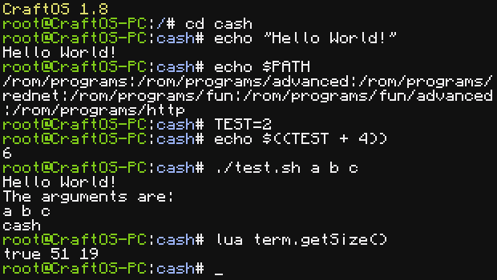

# ComputerCraft Advanced Shell
A Bourne-compatible shell for ComputerCraft.

## Features
* Bash/sh-style command line
* Tab completion (defaulting to file names where not supported)
* Customizable prompts (including ANSI support)
* Local & environment variables
* Argument quoting
* Multiple commands on one line with semicolons
* Many built-in functions (including in-line Lua commands)
* Arithmetic expansion
* If, while, for statements
* Function support
* Shell scripting/shebangs
* rc files
* Restorable history
* Partial CCKernel2 support
* Full compatibility with CraftOS shell.lua

### Missing features
* Backtick/command substitution
* Pipes/console redirection/here documents

### TODO
* Add test boolean operators (-a, -o)
* Add case statement
* Fix environment variables in _ENV
* Add background jobs (like multishell)

## License
This project is licensed under the MIT license. You are free to modify and redistribute cash.lua as long as the copyright notice is preserved at the top of the script.